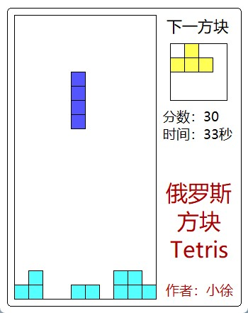
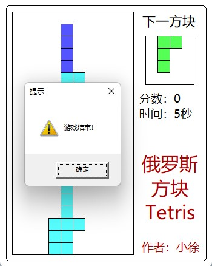

# 有趣小游戏 —— 俄罗斯方块

## 游戏介绍

这是一个使用 C++ 和 EasyX 写的俄罗斯方块小游戏，里面用到的 C++ 特性并不多。游戏主要分成了两个类来实现：Game 和 Block 类，分别用来实现游戏逻辑和单独的俄罗斯方块，里面顶多就用到了静态成员函数和变量的特性，但主要的游戏逻辑还是放到了 main 函数中实现。这样，每个类分工明确，就实现了俄罗斯方块游戏。代码非常简单，里面的每个游戏逻辑都值得初学者分析和学习。最后，大家如果有什么建议或者代码中存在不足，还恳请大家留言，我会尽力修改，提高游戏的代码质量！

## 游戏截图

图1 - 游戏主界面

图 2 - 游戏结束界面

## 代码分析

### 1. Block 类

这个类主要封装了俄罗斯方块中的独立小方块，提供了各种函数来操作方块，比如 move 移动方块、clear 清除方块、draw 绘制方块等等。但其中的重点是方块碰撞的判断和旋转方块的算法：方块碰撞的判断可以先移动方块，接着遍历方块在地图上每一个块的位置，如果这里有块，就说明发生碰撞了；而旋转方块的算法，因为除了长条占四格以外，其它方块只占三格，所以我们采用最简单的方法，只旋转三格以内的块，具体做法是中心块不变，分别旋转十字中心和四个角，长条方块另外处理，于是就实现了 Block 类。

### 2. Game 类

这个类的主要功能是完成游戏界面的绘制和方块满行的判断。游戏界面的绘制很简单，而对于方块满行的判断，可以先遍历一行，如果满行，就将上面的每一行都下移一格位置。这样，Game 类的实现也就大功告成了！

## 构建

### 编译环境

- Windows 11
- Visual Studio 2022
- EasyX_20220901

### 注意事项

如打开源码文件后中文出现乱码，请以 GBK 或类似中文编码重新加载。

### EasyX 下载

官网教程：<https://docs.easyx.cn/zh-cn/setup>

## 许可协议

本项目使用 MIT 协议，任何人都可以复制、修改、发布、使用、销售该源代码，或者在开源项目中引用该源代码，详见 LICENSE 文件。

## 主页

CodeBus - Qt小徐：<https://codebus.cn/qtlittlexu>  
Github - QtLittleXu：<https://github.com/QtLittleXu>
